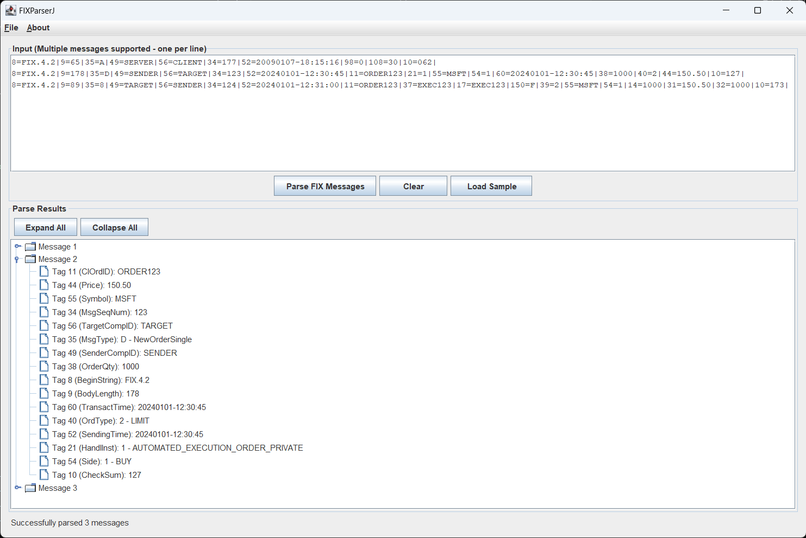

# FIXParserJ

A Java Swing application that uses QuickFIX/J to parse FIX (Financial Information eXchange) messages with a graphical interface.



## Requirements

- Java 21 or higher

## Installation and Usage

### Option 1: Run the Pre-built JAR
```bash
java -jar target/fixparser-app.jar
```

### Option 2: Build from Source
```bash
# Clone or download the project
git clone https://github.com/mrtkp9993/fixparserj
cd fixparserj

# Build the project
mvn clean package

# Run the application
java -jar target/fixparser-app.jar
```

## Using the Application

1. **Start the Application**: Run the JAR file using the command above
2. **Input FIX Message**: 
   - Type or paste a FIX message in the input text area
   - Or click "Load Sample" to load a sample message
   - Or use the pre-filled sample message
3. **Parse the Message**: Click "Parse FIX Message" button
4. **View Results**: 
   - Results are displayed in a table with Message #, Tag, Field Name and Value columns
   - The status bar shows parsing results and total fields parsed
5. **Clear**: Use the "Clear" button to reset all fields

## Supported FIX Message Delimiters

The application automatically converts various FIX message delimiters:
- `|` (pipe character)
- `^` (caret character)  
- `␁` (SOH symbol)
- `\001` (escaped SOH)
- `<SOH>` (SOH text)

All are converted to the proper SOH (ASCII 0x01) character for parsing.

# (UN)LICENSE

This is free and unencumbered software released into the public domain.

Anyone is free to copy, modify, publish, use, compile, sell, or
distribute this software, either in source code form or as a compiled
binary, for any purpose, commercial or non-commercial, and by any
means.

In jurisdictions that recognize copyright laws, the author or authors
of this software dedicate any and all copyright interest in the
software to the public domain. We make this dedication for the benefit
of the public at large and to the detriment of our heirs and
successors. We intend this dedication to be an overt act of
relinquishment in perpetuity of all present and future rights to this
software under copyright law.

THE SOFTWARE IS PROVIDED "AS IS", WITHOUT WARRANTY OF ANY KIND,
EXPRESS OR IMPLIED, INCLUDING BUT NOT LIMITED TO THE WARRANTIES OF
MERCHANTABILITY, FITNESS FOR A PARTICULAR PURPOSE AND NONINFRINGEMENT.
IN NO EVENT SHALL THE AUTHORS BE LIABLE FOR ANY CLAIM, DAMAGES OR
OTHER LIABILITY, WHETHER IN AN ACTION OF CONTRACT, TORT OR OTHERWISE,
ARISING FROM, OUT OF OR IN CONNECTION WITH THE SOFTWARE OR THE USE OR
OTHER DEALINGS IN THE SOFTWARE.

For more information, please refer to <https://unlicense.org>
